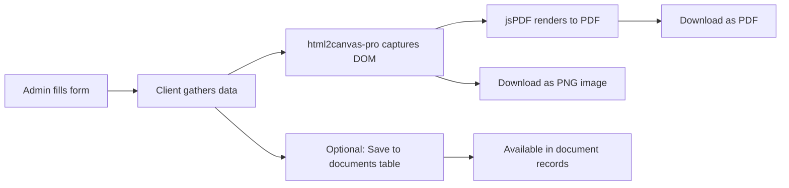

<div align="center">

# 🏗️ SVI Infra Solutions

### _Where Dreams Take Address_

A premium real estate development platform — modern public website, full-featured admin portal, employee workspace, AI-powered chatbot, and an end-to-end document/email/lottery suite.

[](https://nextjs.org)
[](https://react.dev)
[](https://www.typescriptlang.org)
[](https://tailwindcss.com)
[](https://supabase.com)
[](#-license)

[Features](#-features) • [Tech Stack](#-tech-stack) • [Quick Start](#-quick-start) • [Architecture](#-architecture) • [Screenshots](#-screenshots) • [Deploy](#-deployment)

</div>

---

## 📑 Table of Contents

- [🌟 Overview](#-overview)
- [✨ Features](#-features)
  - [Public Website](#-public-website)
  - [Admin Portal](#-admin-portal)
  - [Employee Portal](#-employee-portal)
  - [Client Portal](#-client-portal)
  - [AI & Automation](#-ai--automation)
- [🏗️ Tech Stack](#-tech-stack)
- [🧱 Architecture](#-architecture)
- [🗂️ Project Structure](#-project-structure)
- [🚀 Quick Start](#-quick-start)
- [🔐 Environment Variables](#-environment-variables)
- [📜 Available Scripts](#-available-scripts)
- [🌐 Routing Reference](#-routing-reference)
- [🧩 Component Library](#-component-library)
- [🗃️ Database Migrations](#-database-migrations)
- [🎨 Design System](#-design-system)
- [🧪 Testing](#-testing)
- [🔧 Development Workflow](#-development-workflow)
- [🚀 Deployment](#-deployment)
- [🤝 Third-Party Integrations](#-third-party-integrations)
- [🛠️ Troubleshooting](#-troubleshooting)
- [🤝 Contributing](#-contributing)
- [📄 License](#-license)

---

## 🌟 Overview

**SVI Infra Solutions Pvt. Ltd.** is a 15+ year old real estate developer with **15+ delivered projects** and **5,000+ happy families** across **Noida, Jaipur, and Phulera Smart City** (DMIC/DFC corridors).

This repository hosts the company's full digital platform — a **public marketing website** combined with a **role-based admin portal**, **employee workspace**, and **client portal**, built on Next.js 16 with React Server Components, Supabase authentication, and an AI chatbot.

> **Brand promise:** _Where Dreams Take Address_ — building trust through quality construction, strategic locations, and exceptional customer service.

### Why this project stands out

| Area              | What makes it production-grade                                           |
| ----------------- | ------------------------------------------------------------------------ |
| **Rendering**     | Hybrid RSC + selective client islands via `"use client"` boundary        |
| **Data**          | Server-side Supabase queries, optimistic updates via TanStack Query      |
| **i18n**          | Native locale routing with `next-intl` (English/Hindi, auto-detection)   |
| **Auth**          | Cookie-based Supabase SSR + middleware role-gating for `/admin`          |
| **Documents**     | Client-side jsPDF generation (BBA, invoices, allotment, offer letters)   |
| **State**         | Zustand stores with `persist` middleware for theme & auth                |
| **UI**            | Tailwind v4, Motion animations, MapLibre GL maps, 3D Three.js scenes     |
| **AI**            | Streaming Groq (Llama 4) chatbot + Gemini content generation             |
| **Email**         | Resend transactional + Tiptap-powered campaign editor                    |
| **PWA**           | Service worker with push notifications, background sync, offline support |
| **Quality gates** | Husky pre-commit (lint+format), Commitlint, Vitest, Playwright e2e       |

---

## ✨ Features

### 🏠 Public Website

- **Progressive Web App (PWA)** — Installable with offline support, push notifications, background sync for forms, share target, window-controls-overlay
- **Landing page** — Hero with Motion entrance animations, animated stats counter, scroll-triggered reveals
- **Project showcase** — Current and completed projects with **MapLibre GL** interactive maps, dynamic project detail pages at `/projects/[slug]`
- **Company pages** — About, Leadership (team profiles), Careers, Blog (`/[slug]` dynamic posts)
- **AI Chatbot** — Floating streaming chat widget powered by **Groq Llama 4** via Vercel AI SDK, with lead capture and conversation logging
- **Lottery page** — Feature-flagged via `portal_settings.lottery_page_visible`; live draws, hall of fame, winner carousel
- **Forms** — Contact, Registration, Grievance, Payment (all with hCaptcha + Resend delivery)
- **Calculators** — Interactive financial calculators for property buyers
- **Exclusive Offers** — Special promotions and limited-time deal pages
- **Client Portal** — Authenticated area for clients to view documents, payments, and properties
- **Multi-language** — 🇬🇧 English / 🇮🇳 Hindi via `next-intl` locale routing
- **Theme** — Light/dark/system with `localStorage` persistence and FOUC-free init
- **Legal & consent** — Privacy Policy, Terms & Conditions, GDPR-style cookie banner
- **UX polish** — Reading progress bar, breadcrumbs, back-to-top, WhatsApp button, error boundary, skeletons
- **Share target** — PWA share target integration for receiving shared content

### 🛠️ Admin Portal

> Protected by `middleware.ts` — Supabase SSR session + `profiles.role = 'admin'` check

- **Dashboard** — Recharts analytics (User Growth, Attendance Status, Attendance Trend, Document Stats), KPI cards, activity timeline, quick actions
- **User management** — Full CRUD, role assignment, advisor linking
- **Attendance** — Daily check-in/out, monthly reports, teams with nested member management, geofencing support, pending approval queue
- **Document generator** — Dynamic PDFs for:
  - 📄 **Allotment Letter**
  - 📄 **Builder Buyer Agreement (BBA)** — with legal pages integration
  - 📄 **Offer Letter** (with sales compensation slabs)
  - 📄 **Payment Plan**
  - 📄 **Payment Receipt** / Invoice
  - All with **PDF and PNG image** download options
- **Document records** — Allotment records, BBA records, offer letter records, payment receipt records
- **Property management** — CRUD for real estate listings with image management
- **Registration manager** — View, filter, assign advisors, analytics, filters
- **Email suite** — Tiptap rich text composer, sent history with replies, **templates**, **domains**, **marketing campaigns**, deleted messages, **Resend usage dashboard**, AI-assisted email composition, scheduled emails, email drafts
- **Lottery management** — Schedule draws, upload participants, edit campaigns, bulk email, winner history, draw scheduling
- **Notifications** — Real-time dropdown in admin header, create/read/dismiss workflow
- **Settings** — Tabbed interface: Profile · Company · Appearance · Notifications · Security · Email · Properties · Logs
- **Chat logs** — Conversation history for the AI chatbot with lead information
- **Site visits** — Manage and track property site visit requests
- **Employees** — Employee directory management

### 👥 Employee Portal

- **Employee login** at `/employee/login` (separate route group)
- **Attendance** at `/(employee)/attendance` — dedicated staff check-in/out surface with geofencing
- Distinct auth boundary from admin and clients
- Employee API endpoints for attendance check-in/out

### 🏢 Client Portal

- **Client login** at `/[locale]/login` — authenticated client area
- **Documents** — View and download assigned documents
- **Payments** — View payment history and plans
- **Properties** — View assigned properties
- **Settings** — Profile management
- **Portal allotments** — Admin-managed client allotments

### 🤖 AI & Automation

- **Streaming chatbot** (`/api/chat`) — Vercel AI SDK + `@ai-sdk/groq` (Llama 4) with lead capture
- **Content generation** — `@google/genai` for server-side content
- **Admin chat logs** — Review conversations for support & compliance with lead data
- **AI email composition** — AI-assisted email drafting in the admin email suite
- **Cron endpoints** (`/api/cron/*`) — Scheduled task runners:
  - Lottery draw execution
  - Campaign email processing
  - Scheduled email dispatch
  - Registration cleanup
- **Push notifications** — VAPID-based web push notifications with subscription management

---

## 🔍 Key Implementation Patterns

### Server Component Pattern

```tsx
// app/[locale]/(main)/about/page.tsx
import { createMetadata } from '@/src/lib/seo';
import { AnimatedSection } from '@/src/components/common/ui/AnimatedSection';

export const metadata = createMetadata({
  title: 'About Us',
  description: "Learn about SVI Infra Solutions' 15+ year legacy",
});

export default async function AboutPage() {
  const settings = await getCompanySettings(); // Server-side data fetch
  return (
    <main>
      <AnimatedSection>
        <h1>{settings.companyName}</h1>
        {/* ... */}
      </AnimatedSection>
    </main>
  );
}
```

### Client Island Pattern

```tsx
'use client';

import { motion } from 'motion/react';
import { useEffect, useState } from 'react';

export function InteractiveMap() {
  const [map, setMap] = useState(null);
  // Client-side interactivity, map rendering, etc.
  return <div id="map-container" />;
}
```

### API Route Handler Pattern

```tsx
// app/api/contact/route.ts
import { NextRequest, NextResponse } from 'next/server';
import { createClient } from '@/src/lib/supabase/server';
import { contactSchema } from '@/src/lib/api/schemas';
import { rateLimit } from '@/src/lib/api/rateLimit';

export async function POST(request: NextRequest) {
  const ip = request.headers.get('x-forwarded-for') ?? 'unknown';
  const { success } = await rateLimit(ip);
  if (!success) return NextResponse.json({ error: 'Too many requests' }, { status: 429 });

  const body = await request.json();
  const parsed = contactSchema.safeParse(body);
  if (!parsed.success) return NextResponse.json({ error: parsed.error }, { status: 400 });

  // Process form submission...
  return NextResponse.json({ message: 'Form submitted successfully' });
}
```

### Admin Middleware Guard Pattern

```tsx
// middleware.ts
import { createServerClient } from '@supabase/ssr';
import { NextResponse } from 'next/server';
import type { NextRequest } from 'next/server';

export async function middleware(request: NextRequest) {
  const { pathname } = request.nextUrl;

  // Protect admin routes
  if (pathname.startsWith('/admin') && !pathname.startsWith('/admin/login')) {
    const supabase = createServerClient(
      process.env.NEXT_PUBLIC_SUPABASE_URL!,
      process.env.NEXT_PUBLIC_SUPABASE_ANON_KEY!,
      {
        cookies: {
          /* ... */
        },
      }
    );
    const {
      data: { session },
    } = await supabase.auth.getSession();
    if (!session) return NextResponse.redirect(new URL('/admin', request.url));

    const { data: profile } = await supabase
      .from('profiles')
      .select('role')
      .eq('id', session.user.id)
      .single();
    if (profile?.role !== 'admin') return NextResponse.redirect(new URL('/', request.url));
  }

  return NextResponse.next();
}

export const config = {
  matcher: ['/admin/:path*', '/employee/:path*'],
};
```

---

## 📦 PWA Architecture

### Service Worker (`public/sw.js`)

The custom service worker implements a comprehensive caching strategy:

| Strategy                   | Route                                 | Description                                            |
| -------------------------- | ------------------------------------- | ------------------------------------------------------ |
| **Cache First**            | Static assets (CSS, JS, fonts, icons) | Serve from cache, update in background                 |
| **Network First**          | HTML pages, API calls                 | Try network first, fall back to cache                  |
| **Stale While Revalidate** | Images                                | Serve cached version immediately, update in background |
| **Cache Only**             | App shell, offline page               | Always available offline                               |

### Push Notifications

Push notifications use the VAPID protocol with `web-push` on the server side:

1. **Subscription** — `POST /api/push/subscribe` stores the subscription object in the `push_subscriptions` table
2. **Sending** — Server calls `web-push` library with stored subscriptions
3. **Unsubscription** — `POST /api/push/unsubscribe` removes the subscription
4. **Permission prompt** — `PwaPushPrompt` component shows after user interaction

### Background Sync

The service worker registers for `sync` events for form submissions (contact, registration, grievance). When the user goes offline and submits a form, data is stored in IndexedDB and synced when connectivity returns.

### Share Target

The PWA supports the Web Share Target API, allowing users to share URLs/images directly to the app from other apps on their device, handled by the `/share` route.

---

## 📧 Email Suite Deep Dive

The admin email module is a full-featured email management system:

### Architecture

```
Email Module
├── Compose (/admin/email)
│   ├── TipTap Rich Editor (color, highlight, image, link, text-align, underline)
│   ├── Template Picker (select from saved templates)
│   ├── AI Assistant (compose with AI via /api/admin/email/ai)
│   └── Send via Resend API
├── Campaigns (/admin/email/campaigns)
│   ├── Campaign creation & management
│   ├── Bulk email sending with Resend audiences
│   ├── Campaign analytics & tracking
│   └── Scheduled campaign dispatch via cron
├── Templates (/admin/email/templates)
│   ├── Predefined email templates from JSON
│   └── Custom template creation
├── Sent Mail (/admin/email)
│   ├── Sent message history with threading
│   ├── Reply functionality
│   ├── Star/favorite messages (email_stars table)
│   └── Deleted messages (email_deletions table)
├── Inbox (/api/webhooks/resend/incoming)
│   ├── Inbound email processing via Resend webhooks
│   └── Email threading and conversation grouping
├── Scheduler (/api/cron/process-scheduled-emails)
│   ├── Scheduled email dispatch
│   └── Integration with scheduled_emails table
├── Drafts (/admin/email)
│   ├── Save as draft functionality
│   └── Email drafts table
├── Domains
│   ├── Domain verification status
│   └── DNS configuration guidance
└── Dashboard (/api/admin/email/status)
    ├── Resend API usage metrics
    └── Email sending statistics
```

### Database Tables

| Table              | Purpose                                   |
| ------------------ | ----------------------------------------- |
| `email_inbox`      | Inbound email threading and storage       |
| `email_stars`      | User-specific starred/favorited emails    |
| `email_deletions`  | Soft-delete tracking for emails           |
| `email_drafts`     | Saved email drafts                        |
| `scheduled_emails` | Queued scheduled email dispatches         |
| `campaigns`        | Email campaign definitions and scheduling |

---

## 📄 Document Generation Pipeline

The document generation system uses a client-side approach to avoid server CPU costs:



### Supported Document Types

| Document                          | Route                     | Key Features                                                     |
| --------------------------------- | ------------------------- | ---------------------------------------------------------------- |
| **Allotment Letter**              | `/admin/allotment-letter` | Property details, payment schedule, legal terms                  |
| **Builder Buyer Agreement (BBA)** | `/admin/bba`              | Legal pages integration, clause management, buyer/seller details |
| **Offer Letter**                  | `/admin/offer-letter`     | Sales compensation slabs, installment plan, salary details       |
| **Payment Plan**                  | `/admin/payment-plan`     | Milestone-based payment schedule, due dates                      |
| **Payment Receipt**               | `/admin/payment-receipt`  | Transaction details, bank info, company seal                     |

### Record Management

Each document type has a corresponding records page where generated documents are stored and can be:

- Searched by customer name, date range, or document ID
- Downloaded as PDF or PNG
- Associated with customer profiles
- Printed directly

---

## 🌐 Internationalization (i18n)

The app uses `next-intl` for full English/Hindi localization:

### Setup

```tsx
// src/i18n/request.ts
import { getRequestConfig } from 'next-intl/server';
import { routing } from './routing';

export default getRequestConfig(async ({ requestLocale }) => {
  let locale = await requestLocale;
  if (!locale || !routing.locales.includes(locale)) locale = routing.defaultLocale;
  return {
    locale,
    messages: (await import(`../../messages/${locale}.json`)).default,
  };
});
```

### Routing

| File                     | Purpose                                                    |
| ------------------------ | ---------------------------------------------------------- |
| `src/i18n/routing.ts`    | Locale definitions (en, hi), default locale, path patterns |
| `src/i18n/request.ts`    | Message loading and locale detection                       |
| `src/i18n/navigation.ts` | `useRouter`, `usePathname`, `Link` with locale awareness   |
| `messages/en.json`       | English translations                                       |
| `messages/hi.json`       | Hindi (हिंदी) translations                                 |

### Usage in Components

```tsx
import { useTranslations } from 'next-intl';
import { Link } from '@/src/i18n/navigation';

export function HeroSection() {
  const t = useTranslations('home');
  return (
    <section>
      <h1>{t('hero.title')}</h1>
      <p>{t('hero.subtitle')}</p>
      <Link href="/projects/current">{t('hero.cta')}</Link>
    </section>
  );
}
```

### Locale Switching

The `LanguageToggle` component in the public header lets users switch between:

- 🇬🇧 **English** — Default locale
- 🇮🇳 **हिंदी** — Hindi locale with full translation coverage

Locale is preserved across navigation and stored in the `NEXT_LOCALE` cookie.

---

## 🔐 Security Architecture

### Authentication Layers

| Layer         | Mechanism                                                         | Routes                                  |
| ------------- | ----------------------------------------------------------------- | --------------------------------------- |
| **Public**    | No auth required                                                  | `/[locale]/(main)/*`, `/api/*` (public) |
| **Admin**     | Supabase SSR session + `profiles.role = 'admin'` middleware check | `/admin/*`                              |
| **Employee**  | Supabase SSR session + role check                                 | `/employee/*`, `/(employee)/*`          |
| **API Admin** | `withAdminAuth` wrapper validates session + role                  | `/api/admin/*`                          |

### API Security

- **Rate limiting** — `rateLimit()` utility in `src/lib/api/rateLimit.ts` enforces per-IP limits
- **Input validation** — Zod schemas validate all API payloads
- **Role-based access** — Admin API routes check `profiles.role` before processing
- **Webhook security** — Resend webhook endpoints validate signatures

### Data Protection

| Measure              | Implementation                                                                                  |
| -------------------- | ----------------------------------------------------------------------------------------------- |
| **HTTPS**            | Enforced in production via Vercel                                                               |
| **Security Headers** | X-Content-Type-Options, X-Frame-Options, Referrer-Policy, Permissions-Policy in next.config.mjs |
| **CORS**             | Configured via Vercel/Next.js for API routes                                                    |
| **Database RLS**     | Row Level Security policies on all Supabase tables                                              |
| **Auth Sessions**    | Cookie-based with httpOnly, secure, sameSite flags                                              |

### Push Notification Security

- **VAPID** — Voluntary Application Server Identification for push subscriptions
- **Keys** — Public key exposed to client, private key stored server-side only
- **Subscriptions** — Stored in `push_subscriptions` table with user references

---

## ⚡ Performance Optimization

### Current Optimizations

| Area        | Technique                                            | Implementation                                           |
| ----------- | ---------------------------------------------------- | -------------------------------------------------------- |
| **Images**  | WebP/AVIF format, responsive sizes, 30-day cache TTL | next/image configuration                                 |
| **Bundles** | Optimized package imports                            | `experimental.optimizePackageImports` in next.config.mjs |
| **Fonts**   | System font stack (no external requests)             | next/font with `next/font/local`                         |
| **Maps**    | Open vector tiles (no API key)                       | MapLibre GL with free tile providers                     |
| **PDF**     | Client-side generation (no server CPU)               | jsPDF + html2canvas-pro                                  |
| **State**   | Zustand persist (avoid re-fetch)                     | localStorage persistence                                 |
| **Data**    | TanStack Query caching + optimistic updates          | Stale time, cache invalidation                           |
| **3D**      | Lazy-loaded Three.js scenes                          | Dynamic imports                                          |
| **PWA**     | Cache-first strategy for static assets               | Service worker in public/sw.js                           |

### Database Indexes

Multiple performance index migrations have been applied:

| Migration                    | Key Indexes Created                                           |
| ---------------------------- | ------------------------------------------------------------- |
| `performance-indexes.sql`    | Indexes on profiles, registrations, attendance, notifications |
| `performance-indexes_v2.sql` | Indexes on email, campaigns, lottery tables                   |
| `performance-indexes_v3.sql` | Indexes on chat, push subscriptions, scheduled emails         |

### Bundle Analysis

```bash
# Run bundle analyzer to inspect chunk sizes
npm run analyze
# Opens a visualization of your bundle composition in the browser
```

---

## 🧪 Testing Strategy

### Test Categories

```
Category          │ Tool        │ Location              │ Run command
──────────────────┼─────────────┼───────────────────────┼────────────────
Unit tests        │ Vitest      │ __tests__/            │ npm test
Integration tests │ Vitest      │ __tests__/api/        │ npm test
Component tests   │ Vitest+TL   │ Co-located with components │ npm test
E2E tests         │ Playwright  │ e2e/tests/            │ npm run test:e2e
DB performance    │ Vitest+tsx  │ scripts/test-db-performance.ts │ npm run test:db-performance
```

### Writing Tests

```tsx
// __tests__/api/registration.test.ts
import { describe, it, expect, vi } from 'vitest';

describe('Registration API', () => {
  it('should validate registration payload', async () => {
    const invalidPayload = { name: '' };
    const response = await fetch('/api/registration', {
      method: 'POST',
      body: JSON.stringify(invalidPayload),
    });
    expect(response.status).toBe(400);
  });
});
```

---

## 🗂️ Data Flow Examples

### Registration Flow

```
User → /registration → hCaptcha verification → POST /api/registration
  → Rate limit check → Zod validation → Supabase insert (registrations table)
  → POST /api/registration/notify → Resend email to admin
  → Redirect to /thank-you
```

### Lottery Draw Flow

```
Admin schedules draw → POST /api/admin/lottery/schedule → saved in DB
  → Cron job (POST /api/cron/lottery) checks for pending draws
  → If draw time reached: select winners → update lottery_participants status
  → Trigger notifications to winners
  → Update lottery_campaigns status to 'completed'
  → Display results on public lottery page
```

### Chatbot Flow

```
User types message → POST /api/chat → Vercel AI SDK stream
  → @ai-sdk/groq (Llama 4) processes input with context
  → Streams response back to UI
  → POST /api/chat/log saves conversation
  → POST /api/chat/leads captures lead info if provided
  → Admin views history at /admin/chat-logs
```

---

## 🔧 Environment-Specific Configuration

### Local Development

```bash
# Start dev server on port 3001
npm run dev

# Build for production locally
npm run build
npm run start

# Run tests
npm test
```

### Environment Files

| File              | Purpose                          | Used When                         |
| ----------------- | -------------------------------- | --------------------------------- |
| `.env.local`      | Local overrides (ignored by git) | `npm run dev`                     |
| `.env.production` | Production overrides             | `npm run build` + `npm run start` |
| Vercel Dashboard  | Production env vars              | Vercel deployment                 |

### Vercel Configuration

```json
{
  "framework": "nextjs",
  "buildCommand": "npm run build",
  "outputDirectory": ".next",
  "installCommand": "npm install",
  "crons": [
    {
      "path": "/api/cron/lottery",
      "schedule": "*/5 * * * *"
    },
    {
      "path": "/api/cron/campaigns",
      "schedule": "*/10 * * * *"
    },
    {
      "path": "/api/cron/process-scheduled-emails",
      "schedule": "* * * * *"
    },
    {
      "path": "/api/cron/cleanup-registrations",
      "schedule": "0 0 * * *"
    }
  ]
}
```

---

## 🔄 State Management

### Zustand Stores

#### `authStore`

```ts
interface AuthState {
  user: User | null;
  profile: Profile | null;
  isLoading: boolean;
  setUser: (user: User | null) => void;
  setProfile: (profile: Profile | null) => void;
  clearAuth: () => void;
}
```

- Persisted to localStorage via `persist` middleware
- Used for client-side auth state after SSR session check
- Reset on logout

#### `uiStore`

```ts
interface UIState {
  theme: 'light' | 'dark' | 'system';
  sidebarOpen: boolean;
  setTheme: (theme: 'light' | 'dark' | 'system') => void;
  toggleSidebar: () => void;
}
```

- Theme preference persisted to localStorage
- Sidebar state managed for admin layout
- FOUC-free initialization via `public/theme-init.js`

### TanStack Query

Used primarily in admin panels for:

| Feature            | Query Key                 | Mutation                               |
| ------------------ | ------------------------- | -------------------------------------- |
| User list          | `['users']`               | `useMutation` for create/update/delete |
| Attendance records | `['attendance', date]`    | `useMutation` for check-in/out         |
| Notifications      | `['notifications']`       | `useMutation` for create/dismiss       |
| Email data         | `['emails', folder]`      | `useMutation` for send/delete          |
| Properties         | `['properties']`          | `useMutation` for CRUD                 |
| Lottery            | `['lottery', campaignId]` | `useMutation` for draw/schedule        |

---

## 🚀 Feature Flags

Feature flags are managed via the `portal_settings` table in Supabase:

| Setting Key            | Type    | Default | Description                                |
| ---------------------- | ------- | ------- | ------------------------------------------ |
| `lottery_page_visible` | boolean | `false` | Controls visibility of public lottery page |
| `registration_open`    | boolean | `true`  | Whether new registrations are accepted     |
| `chatbot_enabled`      | boolean | `true`  | Enables/disables the AI chatbot widget     |
| `maintenance_mode`     | boolean | `false` | Shows maintenance page to visitors         |

### Checking Feature Flags

```tsx
// Server-side check
import { createClient } from '@/src/lib/supabase/server';

async function isLotteryVisible() {
  const supabase = await createClient();
  const { data } = await supabase
    .from('portal_settings')
    .select('value')
    .eq('key', 'lottery_page_visible')
    .single();
  return data?.value === true;
}
```

---

## 🎯 Admin Dashboard Deep Dive

The admin dashboard at `/admin/dashboard` provides a comprehensive analytics overview:

### Dashboard Components

| Component             | Data Source                      | Description                                                        |
| --------------------- | -------------------------------- | ------------------------------------------------------------------ |
| **KPI Cards**         | `api/admin/analytics`            | Total users, active today, pending registrations, total properties |
| **User Growth Chart** | `api/admin/analytics`            | Line chart showing new user registrations over time                |
| **Attendance Status** | `api/admin/attendance/analytics` | Pie/donut chart of today's check-in status                         |
| **Attendance Trend**  | `api/admin/attendance/analytics` | Bar chart of weekly/monthly attendance patterns                    |
| **Document Stats**    | `api/admin/documents`            | Summary of generated documents by type                             |
| **Activity Timeline** | `api/admin/activities`           | Real-time feed of admin actions                                    |
| **Quick Actions**     | Static UI                        | Shortcut buttons for common admin tasks                            |

### Analytics API

```tsx
// GET /api/admin/analytics
{
  "totalUsers": 1250,
  "activeToday": 45,
  "pendingRegistrations": 23,
  "totalProperties": 18,
  "userGrowth": [
    { "date": "2026-06-01", "count": 5 },
    { "date": "2026-06-02", "count": 8 },
    // ...
  ]
}
```

---

## 🔔 Notification System

The notification system provides real-time updates across the admin portal:

### Architecture

```
Notification Flow:
  System/Admin action → INSERT into notifications table
    → Supabase Realtime broadcasts to connected clients
    → NotificationDropdown component updates badge count
    → Toast notification via Sonner (if browser tab is active)
    → Optional: Push notification via web-push (if user has subscribed)
```

### Database Schema

| Column       | Type        | Description                              |
| ------------ | ----------- | ---------------------------------------- |
| `id`         | UUID        | Primary key                              |
| `user_id`    | UUID        | Target user (nullable for broadcast)     |
| `title`      | text        | Notification title                       |
| `message`    | text        | Notification body                        |
| `type`       | text        | Category (info, warning, success, error) |
| `read`       | boolean     | Read status                              |
| `created_at` | timestamptz | Creation timestamp                       |
| `link`       | text        | Optional deep link URL                   |

### API Endpoints

| Endpoint                        | Method | Purpose                              |
| ------------------------------- | ------ | ------------------------------------ |
| `/api/admin/notifications`      | GET    | List notifications for current admin |
| `/api/admin/notifications`      | POST   | Create a new notification            |
| `/api/admin/notifications/[id]` | PATCH  | Mark as read/dismiss                 |
| `/api/admin/notifications/[id]` | DELETE | Remove notification                  |

### Real-time Updates

The admin header's notification dropdown uses Supabase Realtime subscriptions to receive new notifications instantly without polling:

```tsx
// Subscription setup (simplified)
useEffect(() => {
  const channel = supabase
    .channel('notifications')
    .on(
      'postgres_changes',
      { event: 'INSERT', schema: 'public', table: 'notifications', filter: `user_id=eq.${userId}` },
      (payload) => {
        addNotification(payload.new);
        toast(payload.new.title);
      }
    )
    .subscribe();
  return () => {
    supabase.removeChannel(channel);
  };
}, [userId]);
```

---

## 🎮 3D Scene Implementation

The project includes Three.js-based 3D scenes for immersive property visualization:

### Technology Stack

| Library              | Version    | Purpose                                               |
| -------------------- | ---------- | ----------------------------------------------------- |
| `three`              | `^0.184.0` | Core 3D engine                                        |
| `@react-three/fiber` | `^9.6.1`   | React renderer for Three.js                           |
| `@react-three/drei`  | `^10.7.7`  | Utility components (OrbitControls, Environment, etc.) |

### Usage

3D scenes are lazy-loaded to avoid impacting initial page load performance:

```tsx
import dynamic from 'next/dynamic';

const BuildingViewer = dynamic(() => import('@/src/components/properties/BuildingViewer'), {
  ssr: false,
  loading: () => <BuildingViewerSkeleton />,
});
```

### Features

- Interactive 3D building models
- Orbit controls for user navigation
- Environment mapping for realistic lighting
- Responsive to container size changes
- Graceful fallback for devices without WebGL support

---

## 📊 Performance Monitoring

### Vercel Analytics

The app uses Vercel's built-in analytics and speed insights:

| Feature         | Implementation           | Purpose                                 |
| --------------- | ------------------------ | --------------------------------------- |
| **Page Views**  | `@vercel/analytics`      | Track page visits, referrers, top pages |
| **Web Vitals**  | `@vercel/speed-insights` | Monitor LCP, INP, CLS, FCP, TTFB        |
| **Geolocation** | Automatic                | Visitor country/city breakdown          |
| **Device Info** | Automatic                | Desktop vs mobile vs tablet             |

### Custom Monitoring

| Tool                           | Purpose                                                 |
| ------------------------------ | ------------------------------------------------------- |
| **Supabase Query Performance** | Monitor slow database queries                           |
| **Resend Dashboard**           | Track email delivery rates and bounces                  |
| **Browser DevTools**           | Network requests, console errors, performance profiling |
| **Lighthouse**                 | Regular audits for accessibility, SEO, performance      |

### Bundle Size Monitoring

```bash
# Generate bundle analysis report
npm run analyze
# Opens http://localhost:8888 with interactive treemap visualization
```

---

## 🧹 Database Maintenance

### Regular Maintenance Tasks

| Task                     | Frequency    | Method                               |
| ------------------------ | ------------ | ------------------------------------ |
| Performance index review | Monthly      | Check `performance-indexes_v3.sql`   |
| Registration cleanup     | Daily        | `/api/cron/cleanup-registrations`    |
| Campaign processing      | Every 10 min | `/api/cron/campaigns`                |
| Scheduled email dispatch | Every minute | `/api/cron/process-scheduled-emails` |
| Lottery draw execution   | Every 5 min  | `/api/cron/lottery`                  |

### Running Migrations

```bash
# Via Supabase CLI
supabase db push

# Manual SQL execution via Supabase Dashboard
# Open SQL Editor and run migration files in order:
# 1. supabase/migration.sql
# 2. supabase/forms-migration.sql
# 3. ... (all migrations in timestamp order)
```

---

## 📝 Blog System

The blog supports dynamic posts with Markdown-like content stored in `src/lib/blog.ts`:

### Blog Data Structure

```ts
// src/lib/blog.ts
export interface BlogPost {
  slug: string;
  title: string;
  excerpt: string;
  content: string;
  author: string;
  date: string;
  image: string;
  tags: string[];
  readTime: string;
}
```

### Blog Routes

| Route          | Description                            |
| -------------- | -------------------------------------- |
| `/blog`        | Blog listing page with paginated posts |
| `/blog/[slug]` | Individual blog post with rich content |

### Adding a New Blog Post

1. Add the post data to the `blogPosts` array in `src/lib/blog.ts`
2. Add a featured image to `public/images/`
3. The post will automatically appear on the blog listing page

---

## 🧮 Financial Calculators

The `/calculators` route provides interactive financial tools for property buyers:

| Calculator                   | Purpose                                                                  |
| ---------------------------- | ------------------------------------------------------------------------ |
| **EMI Calculator**           | Calculate monthly loan installments based on principal, rate, and tenure |
| **Affordability Calculator** | Determine budget based on income and existing obligations                |
| **Stamp Duty Calculator**    | Estimate property registration costs                                     |

All calculators are client-side only and update results in real-time as users adjust inputs.

---

## 📅 Site Visit Management

Site visit requests can be submitted via the public website and managed in admin:

### Flow

```
User submits site visit → POST /api/site-visit
  → Stored in database (chat_leads table with visit columns)
  → Admin views at /admin/site-visits
  → Admin can update status (pending, confirmed, completed, cancelled)
  → Notifications sent to relevant staff
```

### API Endpoints

| Endpoint          | Method | Purpose                                |
| ----------------- | ------ | -------------------------------------- |
| `/api/site-visit` | POST   | Submit a site visit request            |
| `/api/chat/leads` | POST   | Track leads from chatbot conversations |

### Admin Management

The site visits page in admin allows:

- Viewing all visit requests with status
- Filtering by date, property, and status
- Assigning staff members to visits
- Updating visit outcomes

---

## 🔄 Changelog

### v0.1.0 (Current)

Initial release with:

- **Public website** — Landing page, about, projects, blog, contact, FAQ, careers, leadership, calculators, exclusive offers, lottery, privacy policy, terms, grievance, payment
- **Client portal** — Authenticated area with documents, payments, properties, settings
- **Admin portal** — Dashboard, attendance, document generation (BBA, allotment, offer letter, payment plan, receipts), properties, registrations, email suite (compose, campaigns, templates, domains, AI), lottery management, notifications, settings, chat logs, employees, site visits
- **Employee portal** — Login and attendance check-in/out with geofencing
- **PWA** — Service worker, push notifications, background sync, share target, offline support
- **AI chatbot** — Groq Llama 4 streaming chat with lead capture and conversation logging
- **Email system** — Resend integration, TipTap editor, campaigns, scheduled emails, drafts, inbound webhooks
- **Document generation** — Client-side PDF/PNG via jsPDF + html2canvas-pro
- **i18n** — English/Hindi with next-intl locale routing
- **Authentication** — Supabase SSR with role-based middleware
- **Database** — 30+ migration files covering all features
- **Testing** — Vitest unit/integration tests, Playwright e2e tests
- **Tooling** — Husky, Commitlint, ESLint, Prettier, lint-staged

---

## 🐛 Common Debugging Techniques

| Scenario             | Tool/Command                             | What to Look For                                |
| -------------------- | ---------------------------------------- | ----------------------------------------------- |
| **API errors**       | Check Network tab in DevTools            | 4xx/5xx status codes, error messages            |
| **Auth issues**      | Clear cookies, check `profiles` table    | Session expiry, missing role field              |
| **Build failures**   | `npm run clean && npx tsc --noEmit`      | TypeScript errors, missing modules              |
| **Console errors**   | Browser DevTools console                 | Uncaught exceptions, network failures           |
| **Database queries** | Supabase Dashboard > Query Performance   | Slow queries, missing indexes                   |
| **Email issues**     | Resend Dashboard > Logs                  | Delivery failures, bounce reasons               |
| **PWA problems**     | DevTools > Application > Service Workers | Registration status, cache storage              |
| **Bundle size**      | `npm run analyze`                        | Large chunks, duplicate dependencies            |
| **Performance**      | Lighthouse audit                         | LCP, INP, CLS scores, render-blocking resources |

---

## 📚 Additional Resources

| Resource            | Link                                                                                        | Purpose                           |
| ------------------- | ------------------------------------------------------------------------------------------- | --------------------------------- |
| **Next.js Docs**    | [nextjs.org/docs](https://nextjs.org/docs)                                                  | App Router, RSC, route handlers   |
| **Supabase Docs**   | [supabase.com/docs](https://supabase.com/docs)                                              | Auth, database, storage, realtime |
| **Tailwind CSS v4** | [tailwindcss.com/docs](https://tailwindcss.com/docs)                                        | Utility-first CSS framework       |
| **Motion Docs**     | [motion.dev](https://motion.dev)                                                            | Animation library docs            |
| **Resend Docs**     | [resend.com/docs](https://resend.com/docs)                                                  | Email API documentation           |
| **Vercel AI SDK**   | [sdk.vercel.ai/docs](https://sdk.vercel.ai/docs)                                            | AI streaming SDK                  |
| **MapLibre GL**     | [maplibre.org](https://maplibre.org)                                                        | Open-source maps                  |
| **Groq Console**    | [console.groq.com](https://console.groq.com)                                                | AI API keys & quotas              |
| **jsPDF**           | [raw.githack.com/MrRio/jsPDF/master/docs](https://raw.githack.com/MrRio/jsPDF/master/docs/) | PDF generation library            |

---

## 🏗️ Tech Stack

### Core Framework

| Layer      | Technology            | Version   | Why we chose it                         |
| ---------- | --------------------- | --------- | --------------------------------------- |
| Framework  | **Next.js**           | `^16.2.9` | App Router, RSC, route handlers         |
| UI library | **React**             | `^19.2.7` | Server Components, `use()` hook         |
| Language   | **TypeScript**        | `^6.0.3`  | Strict mode, end-to-end type safety     |
| Bundler    | **Webpack** (default) | bundled   | Stable build, full Next.js plugin chain |

### Styling & UI

| Technology                 | Version                        | Purpose                               |
| -------------------------- | ------------------------------ | ------------------------------------- |
| **Tailwind CSS**           | `^4.1.14`                      | Utility-first CSS                     |
| **Motion (Framer Motion)** | `^12.40.0`                     | Scroll-reveal & micro-interactions    |
| **Lucide React**           | `^1.21.0`                      | Open-source icon set                  |
| **Recharts**               | `^3.8.1`                       | Composable charts for admin dashboard |
| **Sonner**                 | `^2.0.7`                       | Toast notifications                   |
| **canvas-confetti**        | `^1.9.4`                       | Confetti for lottery wins             |
| **clsx / tailwind-merge**  | `^2.1.1` / `^3.6.0`            | Conditional class composition         |
| **Radix UI**               | dialog, dropdown-menu, tooltip | Accessible headless UI primitives     |

### State, Data & 3D

| Technology               | Version    | Purpose                                     |
| ------------------------ | ---------- | ------------------------------------------- |
| **Zustand**              | `^5.0.14`  | Lightweight stores (`authStore`, `uiStore`) |
| **TanStack React Query** | `^5.101.0` | Server-state caching, optimistic updates    |
| **TanStack React Table** | `^8.21.3`  | Data tables for admin panels                |
| **@react-three/fiber**   | `^9.6.1`   | 3D scene rendering                          |
| **@react-three/drei**    | `^10.7.7`  | Useful 3D helpers                           |
| **three**                | `^0.184.0` | 3D engine                                   |
| **date-fns**             | `^4.4.0`   | Date formatting                             |

### Backend, Auth & Database

| Technology        | Version    | Purpose                                |
| ----------------- | ---------- | -------------------------------------- |
| **Supabase JS**   | `^2.108.2` | PostgreSQL + auth + storage + realtime |
| **@supabase/ssr** | `^0.12.0`  | Cookie-based SSR sessions              |
| **next-intl**     | `^4.13.0`  | Locale routing (en/hi) + translations  |

### AI Providers

| Technology        | Version    | Purpose                              |
| ----------------- | ---------- | ------------------------------------ |
| **ai (Vercel)**   | `^6.0.198` | Streaming chat & generative UI       |
| **@ai-sdk/groq**  | `^3.0.42`  | Llama 4 inference                    |
| **@ai-sdk/react** | `^3.0.210` | React hooks for AI SDK               |
| **@google/genai** | `^2.4.0`   | Server-side content generation       |
| **web-push**      | `^3.6.7`   | Server-side push notification sender |

### Documents, Forms & Email

| Technology          | Version   | Purpose                                                          |
| ------------------- | --------- | ---------------------------------------------------------------- |
| **jsPDF**           | `^4.2.1`  | Client-side PDF generation                                       |
| **html2canvas-pro** | `^2.0.4`  | HTML → canvas for PDF content                                    |
| **html2pdf.js**     | `^0.14.0` | Alternative PDF generation library                               |
| **ExcelJS**         | `^4.4.0`  | Excel parsing & export                                           |
| **Resend**          | `^6.14.0` | Transactional + marketing email                                  |
| **TipTap**          | `^3.27.1` | Rich text editor (compose, link, image, color, highlight, align) |
| **heic-convert**    | `^2.1.0`  | HEIC → JPEG/PNG in browser                                       |
| **Zod**             | `^4.4.3`  | Schema validation for API payloads                               |
| **maplibre-gl**     | `^5.24.0` | Open-source vector map rendering (no API key)                    |

### Analytics, Testing & Tooling

| Technology                  | Version                | Purpose                          |
| --------------------------- | ---------------------- | -------------------------------- |
| **@vercel/analytics**       | `^2.0.1`               | Page-view & visitor tracking     |
| **@vercel/speed-insights**  | `^2.0.0`               | Real-user Core Web Vitals        |
| **Vitest** + **jsdom**      | `^4.1.9` / `^29.1.1`   | Unit & integration tests         |
| **Playwright**              | `^1.61.0`              | End-to-end browser tests         |
| **ESLint** (flat config)    | `^10.5.0`              | Type-aware linting               |
| **Prettier**                | `^3.8.4`               | Formatter + Tailwind class sort  |
| **Husky** + **lint-staged** | `^9.1.7` / `^17.0.7`   | Git hooks                        |
| **Commitlint**              | `^21.0.2`              | Conventional commit enforcement  |
| **@next/bundle-analyzer**   | `^16.2.9`              | Bundle size inspection           |
| **tsx**                     | `^4.22.4`              | TypeScript execution for scripts |
| **Testing Library**         | React + DOM + jest-dom | Component testing utilities      |

---

## 🧱 Architecture

```
┌──────────────────────────────────────────────────────────────────────────┐
│                          Next.js 16 App Router                           │
│                                                                          │
│   ┌──────────────────┐   ┌──────────────┐   ┌────────────────────┐      │
│   │   /[locale]      │   │   /admin/*   │   │  /employee +        │      │
│   │  public site +   │   │  (protected) │   │  /(employee)        │      │
│   │  client portal   │   └──────┬───────┘   └─────────┬──────────┘      │
│   └──────┬───────────┘          │                     │                 │
│          │                      │                     │                 │
│          ▼                      ▼                     ▼                 │
│   ┌──────────────┐   ┌──────────────┐   ┌────────────────────┐         │
│   │  RSC +       │   │  AdminSession│   │  Employee session   │         │
│   │  Motion/Map  │   │  Provider    │   │  Provider           │         │
│   └──────┬───────┘   └──────┬───────┘   └─────────┬──────────┘         │
│          └──────────┬───────┴───────────┬─────────┘                    │
│                     ▼                   ▼                              │
│            ┌─────────────────┐  ┌──────────────────┐                   │
│            │ middleware.ts   │  │  Zustand stores  │                   │
│            │  (auth + role)  │  │  auth + ui       │                   │
│            └────────┬────────┘  └──────────────────┘                   │
│                     ▼                                                  │
│      ┌──────────────────────────────────────┐                          │
│      │   /api route handlers                │  ← chat, contact,       │
│      │   (public + admin + employee + cron) │     admin/*, push, etc. │
│      └──────────┬───────────────────────────┘                          │
│                 ▼                                                      │
│      ┌──────────────────────────────────────┐                          │
│      │  Supabase (Postgres+Auth+RT+Storage) │  ← profiles, properties,│
│      │                                      │     notifications,       │
│      │                                      │     lottery, campaigns,  │
│      │                                      │     attendance, chat,    │
│      │                                      │     push subscriptions   │
│      └──────────────────────────────────────┘                          │
└──────────────────────────────────────────────────────────────────────────┘
```

### Key architectural decisions

1. **PWA-first** — Hand-crafted service worker (`public/sw.js`) with cache-first static, network-first navigations, stale-while-revalidate images; offline fallback page; Web App Manifest with share target & window-controls-overlay
2. **Hybrid RSC** — Server Components by default; `"use client"` islands for maps, animations, admin interactivity
3. **Locale-first routing** — `app/[locale]/(main)/...` with `next-intl` for English/Hindi
4. **Layered role groups** — `app/admin` (admin), `app/employee` (staff), `app/(employee)` (grouped route), `app/[locale]/(main)/portal` (client)
5. **Cookie-based SSR auth** — `@supabase/ssr` + middleware guard on `/admin/:path*`
6. **Client-side PDF** — jsPDF + html2canvas-pro to avoid server CPU cost; templates live in `src/lib/bba/`
7. **Centralized SEO** — `src/lib/seo.ts` exposes `createMetadata()` with OG, Twitter, canonical, robots
8. **Optimistic UI** — TanStack Query wraps admin mutations; Zustand persists theme + auth slice
9. **No API key for maps** — MapLibre GL uses open vector tiles
10. **Feature flags in DB** — `portal_settings` table drives lottery visibility, etc.
11. **Webpack dev server on port 3001** — configured in package.json scripts

---

## 🗂️ Project Structure

```
svi-new/
├── app/
│   ├── [locale]/                  # Locale-routed public site
│   │   ├── (main)/                #   Public route group
│   │   │   ├── about/             #   /about
│   │   │   ├── admin/             #   /admin (locale-aware redirect)
│   │   │   ├── blog/              #   /blog
│   │   │   │   └── [slug]/        #   /blog/[slug] dynamic posts
│   │   │   ├── calculators/       #   /calculators
│   │   │   ├── careers/           #   /careers
│   │   │   ├── contact/           #   /contact
│   │   │   ├── exclusive-offers/  #   /exclusive-offers
│   │   │   ├── faq/               #   /faq
│   │   │   ├── grievance/         #   /grievance
│   │   │   ├── leadership/        #   /leadership
│   │   │   ├── login/             #   /login (client portal)
│   │   │   ├── lottery/           #   /lottery (feature-flagged)
│   │   │   ├── payment/           #   /payment
│   │   │   ├── portal/            #   Client portal (authenticated)
│   │   │   │   ├── documents/     #     Client documents
│   │   │   │   ├── payments/      #     Client payments
│   │   │   │   ├── properties/    #     Client properties
│   │   │   │   └── settings/      #     Client settings
│   │   │   ├── privacy-policy/    #   /privacy-policy
│   │   │   ├── projects/          #   /projects
│   │   │   │   ├── current/       #     Current projects
│   │   │   │   ├── completed/     #     Completed projects
│   │   │   │   └── [slug]/        #     Dynamic project detail
│   │   │   ├── registration/      #   /registration
│   │   │   ├── terms-conditions/  #   /terms
│   │   │   ├── thank-you/         #   /thank-you
│   │   │   ├── layout.tsx         #   Public layout (Header/Footer)
│   │   │   └── page.tsx           #   Landing page
│   │   └── layout.tsx             # Locale layout
│   ├── admin/                     # Admin portal (middleware-protected)
│   │   ├── allotment-letter/      #   Allotment letter PDF generator
│   │   ├── allotment-records/     #   Allotment record management
│   │   ├── attendance/            #   Employee check-in + reports
│   │   ├── bba/                   #   Builder Buyer Agreement
│   │   ├── bba-records/           #   BBA records
│   │   ├── chat-logs/             #   AI chatbot conversation history
│   │   ├── dashboard/             #   Analytics & KPIs
│   │   ├── email/                 #   Email suite (compose, campaigns, templates...)
│   │   ├── employees/             #   Employee directory
│   │   ├── lottery/               #   Lottery draw management
│   │   ├── notifications/         #   Notification center
│   │   ├── offer-letter/          #   Offer letter PDF
│   │   ├── offer-letter-records/  #   Offer letter records
│   │   ├── payment-plan/          #   Payment plan PDF
│   │   ├── payment-receipt/       #   Payment receipt PDF
│   │   ├── payment-receipts/      #   Payment receipt records
│   │   ├── portal-allotments/     #   Client-facing allotments
│   │   ├── properties/            #   Property CRUD
│   │   ├── registrations/         #   User registration management
│   │   ├── settings/              #   Tabbed system configuration
│   │   ├── site-visits/           #   Site visit management
│   │   ├── layout.tsx             #   Admin layout (sidebar + header)
│   │   └── page.tsx               #   Admin login
│   ├── employee/                  # Employee portal
│   │   └── login/                 #   /employee/login
│   ├── (employee)/                # Employee route group
│   │   └── attendance/            #   Staff attendance surface
│   ├── share/                     # PWA share target handler
│   │   └── page.tsx               #   Share target page
│   ├── api/                       # Route handlers
│   │   ├── admin/                 #   admin/* CRUD endpoints
│   │   │   ├── activities/        #     Activity log CRUD
│   │   │   ├── analytics/         #     Analytics endpoints
│   │   │   ├── attendance/        #     Attendance suite
│   │   │   │   ├── records/       #       Records with pending
│   │   │   │   ├── analytics/     #       Analytics
│   │   │   │   ├── report/        #       Reports
│   │   │   │   ├── approve/       #       Approvals
│   │   │   │   └── teams/         #       Teams with members
│   │   │   ├── campaigns/         #     Email campaigns
│   │   │   ├── documents/         #     Document CRUD
│   │   │   ├── email/             #     Email sending + AI + status
│   │   │   ├── employees/         #     Employee endpoints
│   │   │   ├── lottery/           #     Draw + schedule management
│   │   │   ├── notifications/     #     Notification CRUD
│   │   │   ├── properties/        #     Property CRUD
│   │   │   ├── registrations/     #     Registration + analytics + filters
│   │   │   ├── settings/          #     Portal settings
│   │   │   └── users/             #     User CRUD
│   │   ├── chat/                  #   Streaming AI chat
│   │   │   ├── leads/             #     Lead capture
│   │   │   └── log/               #     Conversation logging
│   │   ├── contact/               #   Contact form
│   │   ├── cron/                  #   Scheduled tasks
│   │   │   ├── campaigns/         #     Campaign processing
│   │   │   ├── cleanup-registrations/ # Registration cleanup
│   │   │   ├── lottery/           #     Draw execution
│   │   │   └── process-scheduled-emails/ # Scheduled email dispatch
│   │   ├── employee/              #   Employee endpoints
│   │   │   └── attendance/        #     Check-in/out
│   │   ├── grievance/             #   Grievance form
│   │   │   └── notify/            #     Notification
│   │   ├── lottery/               #   Public lottery data
│   │   │   └── schedule/          #     Schedule info
│   │   ├── project-images/        #   Image serving
│   │   ├── properties/            #   Public listings
│   │   ├── push/                  #   Push notifications
│   │   │   ├── subscribe/         #     Subscribe
│   │   │   └── unsubscribe/       #     Unsubscribe
│   │   ├── registration/          #   User registration
│   │   │   └── notify/            #     Notification
│   │   ├── site-visit/            #   Site visit requests
│   │   └── webhooks/              #   External integrations
│   │       └── resend/            #     Resend webhooks
│   │           └── incoming/      #       Inbound email
│   ├── layout.tsx                 # Root layout (ClientProviders)
│   ├── error.tsx / global-error.tsx
│   ├── loading.tsx                # Suspense fallback
│   ├── not-found.tsx              # Custom 404
│   ├── opengraph-image.tsx        # Dynamic OG image
│   ├── robots.ts                  # robots.txt
│   ├── sitemap.ts                 # Dynamic sitemap
│   └── globals.css                # Tailwind v4 + tokens
├── src/
│   ├── components/
│   │   ├── common/                # Reusable UI primitives
│   │   │   └── ui/                #   Atomic UI components
│   │   ├── admin/                 # Admin-specific widgets
│   │   │   ├── attendance/        #   Attendance components
│   │   │   ├── bba/               #   BBA components + legal
│   │   │   ├── ChartComponents/   #   Chart components
│   │   │   ├── DocumentGenerator/ #   Document generation
│   │   │   ├── email/             #   Email suite
│   │   │   │   ├── campaigns/     #     Campaign components
│   │   │   │   ├── compose/       #     Composer components
│   │   │   │   ├── hooks/         #     Email hooks
│   │   │   │   └── sections/      #     Email sections
│   │   │   ├── helpers/           #   Helper utilities
│   │   │   ├── lottery/           #   Lottery management
│   │   │   │   ├── hooks/         #     Lottery hooks
│   │   │   │   ├── modals/        #     Lottery modals
│   │   │   │   └── wizard/        #     Lottery wizard
│   │   │   ├── modals/            #   Shared modals
│   │   │   ├── OfferLetter/       #   Offer letter components
│   │   │   ├── registrations/     #   Registration components
│   │   │   ├── settings/          #   Settings components
│   │   │   │   └── hooks/         #     Settings hooks
│   │   │   └── Shared/            #   Shared admin components
│   │   ├── contact/               # Contact form components
│   │   ├── faq/                   # FAQ components
│   │   ├── home/                  # Landing page sections
│   │   ├── layout/                # Header, Footer, nav
│   │   ├── lottery/               # Public lottery client
│   │   │   ├── hooks/             #   Lottery hooks
│   │   │   └── sections/          #   Lottery sections
│   │   ├── portal/                # Client portal components
│   │   ├── projects/              # Project showcase components
│   │   ├── properties/            # Property widgets
│   │   ├── registration/          # Registration components
│   │   ├── ui/                    # Shared UI primitives
│   │   ├── Captcha.tsx
│   │   ├── ClientProviders.tsx    # Theme + Query providers
│   │   ├── PwaPushPrompt.tsx      # Push notification permission banner
│   │   ├── PwaRegister.tsx        # SW registration + update banner + sync toast
│   │   ├── QueryProvider.tsx
│   │   └── ThemeProvider.tsx
│   ├── data/                      # company_settings.json, email-templates.json, faq/
│   ├── hooks/                     # useMounted, useLotteryVisibility, ...
│   ├── i18n/                      # next-intl routing, navigation, request
│   ├── lib/
│   │   ├── api/                   # rateLimit, Zod schemas, withAdminAuth
│   │   ├── data/                  # Data access utilities
│   │   ├── hooks/                 # Cross-cutting hooks
│   │   ├── lottery/               # Campaign helpers
│   │   ├── pwa/                   # PWA utilities (push, background sync, sendPush)
│   │   ├── repositories/          # Server data access
│   │   ├── supabase/              # client / admin / server / types
│   │   ├── utils/                 # documentExporter, templateParser
│   │   ├── blog.ts                # Typed blog posts
│   │   ├── chat-context.ts
│   │   ├── email-templates.ts
│   │   ├── nearby-places.ts
│   │   ├── seo.ts                 # createMetadata() helper
│   │   └── utils.ts
│   ├── services/                  # API service wrappers
│   ├── stores/                    # Zustand stores (authStore, uiStore)
│   └── index.css
├── e2e/                           # Playwright e2e tests
│   ├── playwright.config.ts       # Playwright configuration
│   ├── helpers/                   # Test helpers
│   └── tests/                     # Test specs
├── public/
│   ├── favicons/                  # Multi-size favicon set
│   ├── icons/                     # App icons (192×192, 512×512)
│   ├── images/                    # Static images
│   │   ├── testimonials/          #   Client testimonial photos
│   │   ├── blog1.png, blog2.png, blog3.png
│   │   ├── exclusive_offers_hero.png
│   │   ├── hero1.png, hero2.png, hero3.png
│   │   ├── house1.png
│   │   ├── leadership1.png, leadership2.png, leadership3.png
│   │   └── project1.png, project2.png
│   ├── Shayam angan/              # Project images
│   ├── Shivani Vatika/            # Project images
│   ├── a svi 1.mp4                # Hero video
│   ├── logo.png                   # Company logo
│   ├── signature.png              # Signature for documents
│   ├── manifest.json              # Web App Manifest
│   ├── offline.html               # Offline fallback page
│   ├── sw.js                      # Service worker
│   └── theme-init.js              # FOUC prevention script
├── scripts/                       # Node/TS scripts
│   ├── add_indian_participants.ts
│   ├── analyze-db-tables.ts
│   ├── cleanup-and-test-campaigns.ts
│   ├── convert-heic.js
│   ├── create-admin.ts
│   ├── create-is-admin-function.sql
│   ├── enable-lottery.ts
│   ├── generate-icons.js
│   ├── seed-lottery-51646d2f.ts
│   ├── seed-notifications.ts
│   ├── test_supabase.ts
│   ├── test-auth-sessions.ts
│   ├── test-db-performance.ts
│   ├── test-db.ts
│   ├── test-login.ts
│   ├── test-resend-direct.ts
│   ├── test-resend.ts
│   ├── test-settings-table.ts
│   ├── verify-all.ts
│   └── verify-email-features.ts
├── supabase/                      # Migrations & config
│   ├── migrations/                # Timestamp-ordered SQL migrations
│   ├── migration.sql              # Core schema
│   ├── forms-migration.sql        # Form tables
│   ├── attendance-migration.sql   # Attendance tables
│   ├── notifications-setup.sql    # Notifications system
│   ├── performance-indexes.sql    # Strategic indexes
│   ├── campaigns-migration.sql    # Email campaigns
│   ├── scheduled-draw-migration.sql # Lottery scheduled draws
│   └── .temp/                     # Temporary migration artifacts
├── __tests__/                     # Vitest unit/integration tests
│   ├── api/                       # API tests
│   │   └── admin/                 #   Admin endpoint tests
│   ├── bba/                       # BBA tests
│   └── utils/                     # Utility tests
├── messages/                      # i18n message catalogs
│   ├── en.json                    # English translations
│   └── hi.json                    # Hindi translations
├── types/                         # Ambient type declarations
│   └── next-pwa.d.ts              # PWA type declarations
├── proxy.ts                       # Reverse-proxy helpers
├── next.config.mjs
├── eslint.config.js
├── tsconfig.json
├── vercel.json
└── package.json
```

---

## 🚀 Quick Start

### Prerequisites

| Tool          | Version  | Notes                                        |
| ------------- | -------- | -------------------------------------------- |
| **Node.js**   | `v20+`   | LTS recommended                              |
| **npm**       | bundled  | pnpm/yarn work too                           |
| **Supabase**  | account  | Database, auth, storage                      |
| **Groq**      | API key  | [console.groq.com](https://console.groq.com) |
| **Google AI** | API key  | Optional — Gemini content generation         |
| **Resend**    | API key  | Transactional & campaign email               |
| **hCaptcha**  | site key | Form spam protection                         |

### Installation

```bash
# 1. Clone
git clone https://github.com/Xenonesis/svi-new.git
cd svi-new

# 2. Install
npm install

# 3. Environment
cp .env.example .env.local
# Edit .env.local with your keys (see "Environment Variables" below)

# 4. Database migrations
# Create a Supabase project, then run in order:
#   migration.sql, forms-migration.sql, attendance-migration.sql,
#   notifications-setup.sql, performance-indexes.sql,
#   campaigns-migration.sql, scheduled-draw-migration.sql,
#   supabase/migrations/*.sql (timestamp order)

# 5. Dev server
npm run dev          # → http://localhost:3001
```

---

## 🔐 Environment Variables

```bash
# ── Application ───────────────────────────────────
APP_URL="http://localhost:3001"
NEXT_PUBLIC_ANALYTICS_ID=""

# ── Supabase ──────────────────────────────────────
NEXT_PUBLIC_SUPABASE_URL="https://YOUR_PROJECT_REF.supabase.co"
NEXT_PUBLIC_SUPABASE_ANON_KEY="YOUR_SUPABASE_ANON_KEY"
SUPABASE_SERVICE_ROLE_KEY="YOUR_SUPABASE_SERVICE_ROLE_KEY"

# ── AI Providers ─────────────────────────────────
GROQ_API_KEY="gsk_your_groq_api_key_here"     # Chatbot (Llama 4)
GEMINI_API_KEY="your_gemini_api_key_here"      # Server-side content

# ── Resend (Email) ────────────────────────────────
RESEND_API_KEY="re_your_resend_api_key"
ADMIN_EMAIL="admin@yourdomain.com"

# ── Push Notifications (VAPID) ────────────────
NEXT_PUBLIC_VAPID_PUBLIC_KEY="your_vapid_public_key"
VAPID_PRIVATE_KEY="your_vapid_private_key"
VAPID_EMAIL="mailto:info@yourdomain.com"

# ── hCaptcha (use test key locally) ──────────────
NEXT_PUBLIC_HCAPTCHA_SITE_KEY="10000000-ffff-ffff-ffff-000000000001"
```

---

## 📜 Available Scripts

| Script                | Command                                                     | Purpose                 |
| --------------------- | ----------------------------------------------------------- | ----------------------- |
| `dev`                 | `next dev --webpack --port 3001`                            | Dev server with HMR     |
| `build`               | `next build`                                                | Production build        |
| `analyze`             | `ANALYZE=true next build`                                   | Inspect bundle size     |
| `start`               | `next start`                                                | Serve production build  |
| `lint`                | `eslint . --ext .ts,.tsx,.js,.jsx`                          | Static analysis         |
| `lint:fix`            | `eslint . --ext .ts,.tsx,.js,.jsx --fix`                    | Auto-fix lint issues    |
| `format`              | `prettier --write .`                                        | Format all files        |
| `format:check`        | `prettier --check .`                                        | Verify formatting       |
| `editorconfig`        | `editorconfig-checker`                                      | Editorconfig compliance |
| `test`                | `vitest run`                                                | Unit/integration tests  |
| `test:watch`          | `vitest`                                                    | Watch mode              |
| `test:e2e`            | `playwright test --config=e2e/playwright.config.ts`         | End-to-end tests        |
| `test:e2e:ui`         | `playwright test --ui --config=e2e/playwright.config.ts`    | Playwright UI debugger  |
| `test:e2e:debug`      | `playwright test --config=e2e/playwright.config.ts --debug` | Playwright debug mode   |
| `test:db-performance` | `tsx scripts/test-db-performance.ts`                        | Database performance    |
| `generate-icons`      | `node scripts/generate-icons.js`                            | Regenerate app icons    |
| `clean`               | `rm -rf .next`                                              | Wipe build artifacts    |
| `prepare`             | `husky`                                                     | Install git hooks       |

---

## 🌐 Routing Reference

### Public (`/`, `/{locale}/`)

| Route                 | Description                               |
| --------------------- | ----------------------------------------- |
| `/`                   | Landing page — hero, projects, AI chatbot |
| `/about`              | Company history, mission, vision, values  |
| `/blog`               | Market insights & company news            |
| `/blog/[slug]`        | Dynamic blog posts                        |
| `/calculators`        | Interactive financial calculators         |
| `/careers`            | Job openings                              |
| `/contact`            | Inquiry form → Resend                     |
| `/exclusive-offers`   | Special promotions & deals                |
| `/faq`                | Data-driven FAQ accordion                 |
| `/grievance`          | Complaint submission with tracking        |
| `/leadership`         | Management team profiles                  |
| `/login`              | Client portal login                       |
| `/lottery`            | Feature-flagged lottery                   |
| `/payment`            | Online payment portal                     |
| `/portal/documents`   | Client document access                    |
| `/portal/payments`    | Client payment history                    |
| `/portal/properties`  | Client property overview                  |
| `/portal/settings`    | Client profile settings                   |
| `/privacy-policy`     | Data protection                           |
| `/projects`           | Project listing                           |
| `/projects/current`   | Ongoing developments                      |
| `/projects/completed` | Delivered projects + MapLibre GL map      |
| `/projects/[slug]`    | Dynamic project detail page               |
| `/registration`       | New user registration                     |
| `/terms-conditions`   | Terms of service                          |
| `/thank-you`          | Post-submission confirmation              |
| `/share`              | PWA share target handler                  |

### Admin (middleware-protected)

| Route                         | Description                                                                           |
| ----------------------------- | ------------------------------------------------------------------------------------- |
| `/admin`                      | Admin login                                                                           |
| `/admin/dashboard`            | Analytics, KPIs, activity timeline                                                    |
| `/admin/attendance`           | Check-in/out, reports, teams                                                          |
| `/admin/allotment-letter`     | Allotment letter PDF                                                                  |
| `/admin/allotment-records`    | Allotment records                                                                     |
| `/admin/bba`                  | Builder Buyer Agreement                                                               |
| `/admin/bba-records`          | BBA records                                                                           |
| `/admin/chat-logs`            | AI chatbot conversation history                                                       |
| `/admin/email`                | Compose, sent, templates, domains, campaigns                                          |
| `/admin/employees`            | Employee directory                                                                    |
| `/admin/lottery`              | Draw management & scheduling                                                          |
| `/admin/notifications`        | Notification center                                                                   |
| `/admin/offer-letter`         | Offer letter PDF                                                                      |
| `/admin/offer-letter-records` | Offer letter records                                                                  |
| `/admin/payment-plan`         | Payment plan PDF                                                                      |
| `/admin/payment-receipt`      | Payment receipt PDF                                                                   |
| `/admin/payment-receipts`     | Payment receipt records                                                               |
| `/admin/portal-allotments`    | Client-facing allotments                                                              |
| `/admin/properties`           | Property CRUD                                                                         |
| `/admin/registrations`        | Registration management                                                               |
| `/admin/settings`             | Profile · Company · Appearance · Notifications · Security · Email · Properties · Logs |
| `/admin/site-visits`          | Site visit management                                                                 |

### Employee

| Route                    | Description                      |
| ------------------------ | -------------------------------- |
| `/employee/login`        | Staff authentication             |
| `/(employee)/attendance` | Staff check-in/out (route group) |

### API

#### Public

| Route                                | Method | Description               |
| ------------------------------------ | ------ | ------------------------- |
| `/api/chat`                          | POST   | Streaming AI chat         |
| `/api/chat/leads`                    | POST   | Chat lead capture         |
| `/api/chat/log`                      | POST   | Conversation logging      |
| `/api/contact`                       | POST   | Contact form              |
| `/api/cron/campaigns`                | POST   | Campaign processing       |
| `/api/cron/cleanup-registrations`    | POST   | Registration cleanup      |
| `/api/cron/lottery`                  | POST   | Draw execution            |
| `/api/cron/process-scheduled-emails` | POST   | Scheduled email dispatch  |
| `/api/grievance`                     | POST   | Grievance form            |
| `/api/grievance/notify`              | POST   | Grievance notification    |
| `/api/lottery`                       | GET    | Public lottery data       |
| `/api/lottery/schedule`              | GET    | Lottery schedule          |
| `/api/project-images`                | GET    | Image serving             |
| `/api/properties`                    | GET    | Public listings           |
| `/api/push/subscribe`                | POST   | Push subscription         |
| `/api/push/unsubscribe`              | POST   | Push unsubscription       |
| `/api/registration`                  | POST   | User registration         |
| `/api/registration/notify`           | POST   | Registration notification |
| `/api/site-visit`                    | POST   | Site visit request        |
| `/api/webhooks/resend/incoming`      | POST   | Inbound email webhook     |

#### Admin

| Route                                                      | Description             |
| ---------------------------------------------------------- | ----------------------- |
| `/api/admin/activities`                                    | Activity log CRUD       |
| `/api/admin/analytics`                                     | Analytics endpoints     |
| `/api/admin/attendance/records` (+ `/pending`)             | Attendance records      |
| `/api/admin/attendance/analytics`                          | Attendance analytics    |
| `/api/admin/attendance/report`                             | Attendance reports      |
| `/api/admin/attendance/approve`                            | Attendance approvals    |
| `/api/admin/attendance/teams` (+ `/[id]/members/[userId]`) | Team management         |
| `/api/admin/bba`                                           | BBA management          |
| `/api/admin/campaigns` (+ `/[id]`, `/[id]/send`)           | Email campaigns         |
| `/api/admin/documents` (+ `[id]`)                          | Document CRUD           |
| `/api/admin/email` (+ `/ai`, `/status`)                    | Email sending + AI      |
| `/api/admin/employees` (+ `[id]`)                          | Employee endpoints      |
| `/api/admin/lottery` (+ `/draw`, `/schedule`)              | Draw management         |
| `/api/admin/notifications` (+ `[id]`)                      | Notification CRUD       |
| `/api/admin/properties`                                    | Property CRUD           |
| `/api/admin/registrations` (+ `/analytics`, `/filters`)    | Registration management |
| `/api/admin/settings`                                      | Portal settings         |
| `/api/admin/users` (+ `[id]`)                              | User CRUD               |

---

## 🧩 Component Library

### Provider hierarchy (`ClientProviders.tsx`)

```
QueryProvider              ← TanStack Query (devtools on client)
  └─ ThemeProvider         ← Light/dark/system with localStorage
       └─ AnalyticsTracker ← Vercel Analytics + Speed Insights
```

Admin layout additionally wraps children in `AdminSessionProvider`.

### Public UI primitives (`src/components/common/ui` and `src/components/ui`)

| Component              | Description                             |
| ---------------------- | --------------------------------------- |
| `AnimatedSection`      | Scroll-reveal via `motion` `useInView`  |
| `BackToTop`            | Floating scroll-to-top                  |
| `Breadcrumbs`          | Auto-generated from URL path            |
| `CookieConsent`        | GDPR consent banner w/ localStorage     |
| `DynamicSkeleton`      | Loading placeholders                    |
| `ErrorBoundary`        | React error boundary + fallback         |
| `HoverZoomImage`       | CSS transform zoom on hover             |
| `LanguageToggle`       | EN / हिं switcher                       |
| `ReadingProgress`      | Top-of-page scroll indicator            |
| `ScrollToTop`          | Auto-scroll on route change             |
| `StatsCounter`         | Spring-physics count-up on scroll       |
| `ThemeToggle`          | Light/dark/system switcher              |
| `AnalyticsTracker`     | Vercel Analytics + Speed Insights mount |
| `stagger-testimonials` | Staggered motion variants               |

### Home (`src/components/home/`)

`HeroSection`, `AboutSection`, `FeaturesSection`, `ProjectsSection`, `CTASection`, `ChatBot`, `HomeFAQ`, `HomeSections` (orchestrator)

### Admin (`src/components/admin/`)

- `AdminHeader`, `AdminSidebar`, `AdminSessionProvider`
- `ActivityTimeline`, `NotificationDropdown`, `QuickActions`
- `attendance/` — Check-in/out UI, reports, team management
- `bba/` — BBA form components with legal page integration
- `ChartComponents/` — Recharts chart wrappers
- `DocumentGenerator/` — PDF generation UI
- `email/` — compose, campaigns, templates, domains, settings, hooks, sections
- `lottery/` — dashboard, history, schedule-draw, wizard, modals, hooks
- `modals/` — advisor, create-user, delete-confirm, edit-user
- `OfferLetter/` — Offer letter form with tests
- `registrations/` — table, filters, detail modals, status badges
- `settings/` — Profile · Company · Appearance · Notifications · Security · Email · Logs · Properties · hooks
- `helpers/` — badge, property interest tags, property labels
- `Shared/Modal`

### Portal & lottery

- `portal/PortalSidebar` — client-portal navigation
- `lottery/LotteryClientSection`, `LotteryCTA`, `LotteryDrawSection`
- `lottery/sections/` — `CountdownBanner`, `DrawArenaModal`, `HallOfFame`, `WinnerCarousel`
- `lottery/hooks/useLotteryDraw`

### Feature-specific components

- `contact/` — Contact form components
- `faq/` — FAQ accordion components
- `projects/` — Project showcase components
- `properties/` — Property listing widgets
- `registration/` — Registration form components

### Data, hooks, lib

- `data/company_settings.json` — name, address, GST, RERA, bank
- `data/email-templates.json` — email template definitions
- `data/faq/general.ts` — FAQ content
- `lib/seo.ts` — `createMetadata()` helper
- `lib/blog.ts` — typed `BlogPost[]` with slug map
- `lib/api/{rateLimit,schemas,withAdminAuth}.ts`
- `lib/supabase/{client,admin,server,types}.ts`
- `lib/utils/{documentExporter,templateParser}.ts`
- `lib/email-templates.ts`, `lib/nearby-places.ts`, `lib/chat-context.ts`
- `lib/pwa/` — Push notification utilities, background sync, sendPush
- `lib/repositories/` — Server data access layer
- `lib/data/` — Data access utilities
- `lib/hooks/` — Cross-cutting hooks
- `lib/lottery/` — Campaign helper utilities
- `stores/{authStore,uiStore}.ts` (Zustand + persist)
- `hooks/useMounted`, `hooks/useLotteryVisibility`

---

## 🗃️ Database Migrations

Run in order against a fresh Supabase project:

### Root-level migration files

| File / Migration                        | Purpose                       |
| --------------------------------------- | ----------------------------- |
| `supabase/migration.sql`                | Core schema (users, projects) |
| `supabase/forms-migration.sql`          | Form submission tables        |
| `supabase/attendance-migration.sql`     | Attendance tracking           |
| `supabase/notifications-setup.sql`      | Notifications system          |
| `supabase/performance-indexes.sql`      | Strategic indexes             |
| `supabase/campaigns-migration.sql`      | Email campaigns               |
| `supabase/scheduled-draw-migration.sql` | Lottery scheduled draws       |

### Timestamp-ordered migration files (`supabase/migrations/`)

| File                                                      | Purpose                           |
| --------------------------------------------------------- | --------------------------------- |
| `20260520120000_forms_tables.sql`                         | Forms tables                      |
| `20260520130000_attendance_tables.sql`                    | Attendance tables                 |
| `20260520140000_activity_logs_check_constraint.sql`       | Activity log constraint           |
| `20260520150000_fix_notifications_trigger.sql`            | Notification trigger fix          |
| `20260522130000_create_portal_settings.sql`               | Portal settings                   |
| `20260528150000_create_lotteries_table.sql`               | Lottery system                    |
| `20260528180000_lottery_visibility_policy.sql`            | Lottery visibility RLS            |
| `20260529120000_add_registration_fields.sql`              | Registration fields               |
| `20260529130000_add_real_email_to_profiles.sql`           | Real email on profiles            |
| `20260529130500_add_registration_status.sql`              | Registration status               |
| `20260529140000_create_properties_table.sql`              | Properties table                  |
| `20260529174000_add_submission_id_to_registrations.sql`   | Submission ID on registrations    |
| `20260530150000_add_registration_important_field.sql`     | Important flag on registrations   |
| `20260531090000_performance_indexes.sql`                  | Performance indexes               |
| `20260531100000_scheduled_draw_migration.sql`             | Scheduled draw migration          |
| `20260531110000_campaigns_migration.sql`                  | Campaigns migration               |
| `20260602100000_add_lottery_id_to_campaigns.sql`          | Lottery ID on campaigns           |
| `20260609000001_create_chat_leads.sql`                    | Chat leads table                  |
| `20260609000002_create_chat_logs.sql`                     | Chat logs table                   |
| `20260610110000_add_attachments_to_email_inbox.sql`       | Email inbox attachments           |
| `20260611000000_customer_portal_tables.sql`               | Customer portal tables            |
| `20260611090558_add_property_fields.sql`                  | Additional property fields        |
| `20260611101402_add_employee_geofencing.sql`              | Employee geofencing               |
| `20260611110000_create_scheduled_emails.sql`              | Scheduled emails table            |
| `20260613100000_performance_indexes_v2.sql`               | Performance indexes v2            |
| `20260616000000_sprint_redesign_tables.sql`               | Sprint redesign tables            |
| `20260621054522_create_email_drafts.sql`                  | Email drafts table                |
| `20260622160000_performance_indexes_v3.sql`               | Performance indexes v3            |
| `20260623000001_add_site_visit_columns_to_chat_leads.sql` | Site visit columns on chat leads  |
| `20260628000001_create_push_subscriptions.sql`            | Push subscriptions table          |
| `20260610_fix_email_inbox_rls_and_from_name.sql`          | Fix email inbox RLS and from_name |

### Additional migration files (root level)

| File                                                       | Purpose                 |
| ---------------------------------------------------------- | ----------------------- |
| `supabase/20260602100001_create_email_stars_table.sql`     | Email star/favorite     |
| `supabase/20260602100002_create_email_inbox_table.sql`     | Email inbox/threading   |
| `supabase/20260602100003_create_email_deletions_table.sql` | Email deletion tracking |
| `supabase/20260602100004_add_email_data_to_deletions.sql`  | Email data in deletions |

---

## 🎨 Design System

| Token           | Choice                                                                   |
| --------------- | ------------------------------------------------------------------------ |
| **Framework**   | Tailwind v4 with CSS variables (`@theme` block in `globals.css`)         |
| **Type**        | System font stack via `next/font` (no external font requests)            |
| **Color**       | Brand `primary` + semantic tokens; light/dark via `prefers-color-scheme` |
| **Motion**      | `motion` (Framer Motion 12) for entrances & scroll-reveal                |
| **Iconography** | `lucide-react` (1.21) — consistent stroke weight                         |
| **Spacing**     | Tailwind scale (4px base)                                                |
| **Radius**      | Tailwind `rounded-{sm,md,lg,xl,2xl,3xl,full}`                            |
| **Shadow**      | Layered `shadow-{sm,md,lg,xl}` for elevation                             |
| **Breakpoints** | Tailwind defaults — `sm` 640, `md` 768, `lg` 1024, `xl` 1280             |

### Animation catalogue

| Element          | Animation                                     |
| ---------------- | --------------------------------------------- |
| Hero section     | Fade-in + scale entrance on load              |
| Scroll reveal    | `AnimatedSection` + `useInView` upward fade   |
| Stats counter    | Spring-physics count-up                       |
| Nav hover        | Gold underline slides in from left            |
| Header           | Transparent → solid + backdrop blur on scroll |
| Theme switch     | Cross-fade light/dark                         |
| FAQ accordion    | Smooth height + opacity                       |
| Project cards    | Lift + shadow on hover                        |
| Reading progress | Top bar tracking scroll position              |
| Lottery win      | Confetti burst via `canvas-confetti`          |

---

## 🧪 Testing

- **Vitest** + **jsdom** — unit & integration
- **Playwright** — end-to-end browser tests (`e2e/`)

```
__tests__/
├── api/
│   ├── admin/           # analytics, attendance, documents, teams, users
│   ├── registration.test.ts
├── bba/
├── utils/
│   └── templateParser.test.ts
```

```bash
npm test            # all unit/integration
npm run test:watch  # watch mode
npm run test:e2e    # Playwright
npm run test:e2e:ui # interactive UI
npm run test:e2e:debug # debug mode
npm run test:db-performance # database performance tests
```

---

## 🔧 Development Workflow

### Git hooks (Husky)

| Hook         | Action                                                |
| ------------ | ----------------------------------------------------- |
| `pre-commit` | `lint-staged` → ESLint fix + Prettier on staged files |
| `commit-msg` | Commitlint validates conventional commit format       |

### Commit convention

```
<type>(<scope>): <description>

feat(admin): add attendance check-in/out UI
fix(header): resolve mobile menu overflow on iOS
chore(deps): bump next to 16.2.9
```

**Types:** `feat`, `fix`, `docs`, `style`, `refactor`, `perf`, `test`, `build`, `ci`, `chore`, `revert`

### Lint-staged targets

| Glob                   | Checks                |
| ---------------------- | --------------------- |
| `*.{ts,tsx,js,jsx}`    | ESLint fix + Prettier |
| `*.{json,md,yml,yaml}` | Prettier              |

### Next.js config highlights

- React Strict Mode **on**
- Compression **on**
- Security headers: `X-Content-Type-Options`, `X-Frame-Options: DENY`, `Referrer-Policy: strict-origin-when-cross-origin`, `Permissions-Policy` (camera/mic/geo off)
- Image optimization: WebP/AVIF, responsive sizes, 30-day cache TTL
- Optimized package imports: `lucide-react`, `recharts`, `date-fns`, `motion`, `@tiptap/react`, `@tiptap/starter-kit`
- Webpack watch options configured for dev performance
- Turbopack root detection fix for multiple lockfiles
- Bundle analyzer support via `ANALYZE=true`

---

## 🚀 Deployment

### Vercel (recommended)

```bash
# One-time
vercel link

# Set env vars in Vercel project settings, then:
git push origin main    # auto-deploys via GitHub integration
```

`vercel.json`:

```json
{
  "framework": "nextjs",
  "buildCommand": "npm run build",
  "outputDirectory": ".next",
  "installCommand": "npm install"
}
```

### Other platforms

- **AWS** — Amplify or ECS/Fargate
- **Google Cloud Run** — wrap with a Dockerfile (`npm run build && npm run start`)
- **Azure** — Static Web Apps
- **Self-hosted** — `node` server running `npm run start`

---

## 🤝 Third-Party Integrations

| Service                   | Usage                                                         |
| ------------------------- | ------------------------------------------------------------- |
| **Groq (Llama 4)**        | Streaming chatbot via Vercel AI SDK                           |
| **Google Gemini**         | Server-side content generation                                |
| **MapLibre GL**           | Open-source project location maps (no API key)                |
| **hCaptcha**              | Form spam protection on contact & registration                |
| **Resend**                | Transactional email + marketing campaigns + domain mgmt       |
| **TipTap**                | Rich text editor for email composer                           |
| **Vercel Analytics**      | Privacy-friendly traffic tracking                             |
| **Vercel Speed Insights** | Real-user Core Web Vitals (LCP, INP, CLS)                     |
| **Supabase Realtime**     | WebSocket updates for notifications & activity feed           |
| **ExcelJS**               | Excel parsing & export                                        |
| **Sonner**                | Toast notifications                                           |
| **web-push**              | Server-side push notification sending (VAPID)                 |
| **canvas-confetti**       | Lottery win celebrations                                      |
| **Zod**                   | API payload validation                                        |
| **Radix UI**              | Accessible headless UI primitives (dialog, dropdown, tooltip) |
| **TanStack React Table**  | Data table management for admin panels                        |
| **html2pdf.js**           | Alternative PDF generation                                    |
| **heic-convert**          | HEIC image format conversion in browser                       |

---

## 🛠️ Troubleshooting

| Issue                       | Fix                                                                              |
| --------------------------- | -------------------------------------------------------------------------------- |
| Dev server won't start      | Node 20+; `rm -rf node_modules .next && npm install`; `npm run clean`            |
| Supabase connection errors  | Verify `.env.local` keys; check project is active; review IP allowlist           |
| Auth not working            | Run **all** migrations in order; enable email/password in Supabase; set site URL |
| MapLibre not rendering      | Check browser console for CORS; verify tile CDN reachable                        |
| AI chatbot not responding   | Confirm `GROQ_API_KEY`; check Quota page on Groq                                 |
| Emails not sending          | Verify `RESEND_API_KEY`; check sender domain verification status                 |
| Lottery page not visible    | `portal_settings.lottery_page_visible` must be `true`                            |
| Build failures              | `npm run clean`; `npx tsc --noEmit`; ensure all env vars are set                 |
| Admin redirect loop         | Clear cookies; verify `profiles.role = 'admin'`; check middleware config         |
| Locale not switching        | Confirm `next-intl` config in `src/i18n/routing.ts`; clear `NEXT_LOCALE` cookie  |
| 3D scene not loading        | Check `three`/`@react-three/fiber` versions; look for WebGL errors               |
| Dev server on wrong port    | Default is port 3001; check `npm run dev` script in `package.json`               |
| Push notifications fail     | Verify VAPID keys match between env and subscription; check browser permission   |
| PWA not installable         | Ensure HTTPS (or localhost); verify manifest.json is valid; check service worker |
| Email campaigns not sending | Check Resend domain verification; verify campaign status in admin panel          |
| Attendance geofencing       | Verify employee geofencing settings in database; check browser location perms    |

---

## 🤝 Contributing

1. Fork & branch: `git checkout -b feat/your-feature`
2. Code with TypeScript strict + tests for new behavior
3. Quality gates: `npm test && npm run lint && npm run format:check`
4. Commit conventionally: `feat(scope): description`
5. Push & open a PR

### Code style

- TypeScript strict mode, explicit types
- Prefer Server Components; use `"use client"` only for islands
- `@/` path alias for imports (e.g. `@/src/components/common/BackToTop`)
- Reusable UI → `src/components/common/`, feature UI co-located
- Page metadata via `createMetadata()` from `src/lib/seo.ts`
- Use `clsx` + `tailwind-merge` for conditional classes
- Trust Prettier's auto-sorted Tailwind class order
- Always run migrations in timestamp order
- Use `tsx` for running TypeScript scripts directly
- Run `npm run prepare` after cloning to install Husky hooks

### Scripts directory

The `scripts/` directory contains utility scripts for:

- **Database operations** — `create-admin.ts`, `test-db.ts`, `test-db-performance.ts`, `analyze-db-tables.ts`
- **Seeding** — `seed-lottery-51646d2f.ts`, `seed-notifications.ts`, `add_indian_participants.ts`
- **Testing** — `test-resend.ts`, `test-resend-direct.ts`, `test-login.ts`, `test-auth-sessions.ts`, `test-settings-table.ts`, `test_supabase.ts`
- **Verification** — `verify-all.ts`, `verify-email-features.ts`
- **Maintenance** — `enable-lottery.ts`, `cleanup-and-test-campaigns.ts`, `convert-heic.js`, `generate-icons.js`

---

## 📄 License

**Private** — © 2026 SVI Infra Solutions Pvt. Ltd. All rights reserved.

Unauthorized copying, distribution, or use of this software, via any medium, is strictly prohibited without prior written permission.

---

<div align="center">

[⬆ Back to top](#-svi-infra-solutions)

Made with ❤️ by the SVI Infra Solutions engineering team

</div>
